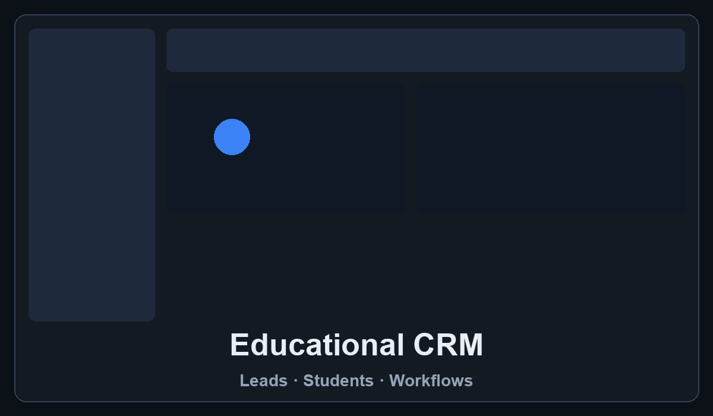
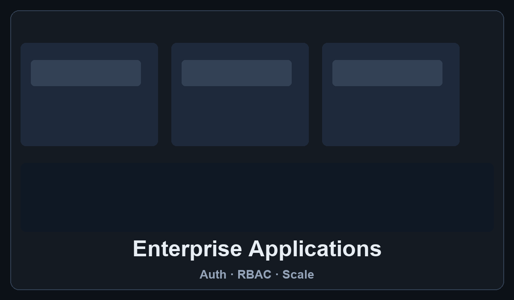
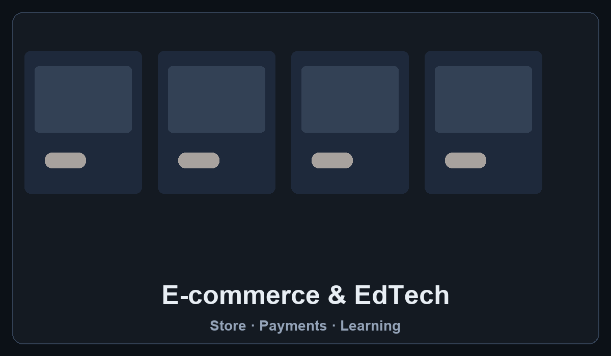
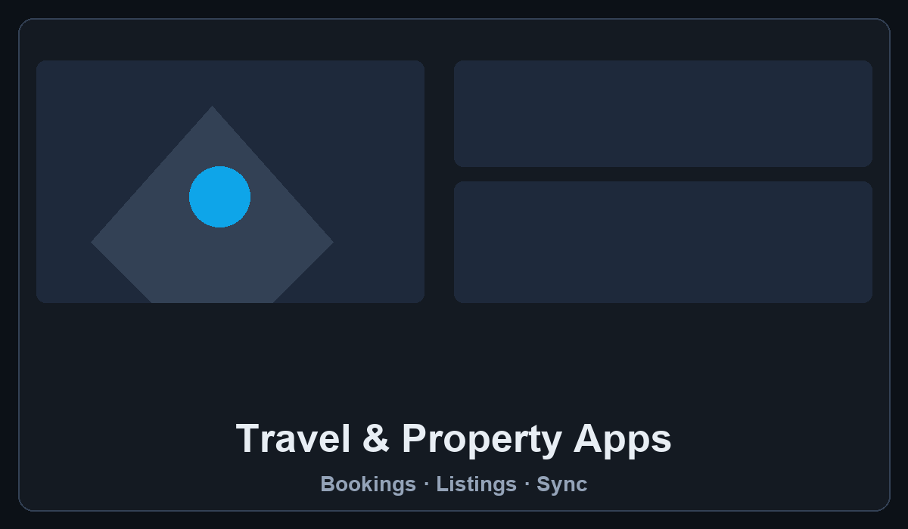

<div align="center">


<p align="center">
  <a href="#features">Features</a> •
  <a href="#resume">Resume</a> •
  <a href="#demo">Demo</a> •
  <a href="#assets">Assets</a> •
  <a href="#installation">Installation</a> •
  <a href="#tech-stack">Tech Stack</a>
</p>

[](https://github.com/trajpal2/portfolio)
[](https://trajpal2.github.io/portfolio)
[](https://nextjs.org)

<p align="center">A modern portfolio built with Next.js 14, React, and Tailwind CSS — experience timeline, tech stack, projects, contact form, and a dedicated resume page with PDF preview and download.</p>

</div>

## ✨ Features

- **Homepage** (`/`) — About, achievements, experience, tech stack, projects, and contact
- **Resume page** (`/resume`) — PDF preview, view in browser, and download (not on the homepage)
- **Contact API** — SMTP email via Nodemailer (`POST /api/contact`)
- **Site analytics (JSON)** — Visit, resume download, and contact counts in `data/site-stats.json`
- **SEO** — Metadata, Open Graph, `sitemap.xml`, `robots.txt`, and JSON-LD
- **3D & motion** — Three.js hero canvas, Framer Motion, dark minimalist theme

## 📄 Resume

Linked from the navbar **Resume** item. Lives only on `/resume`, not as a homepage section.

| Route | Live URL |
|-------|----------|
| Resume page | [trajpal2.github.io/portfolio/resume](https://trajpal2.github.io/portfolio/resume) |

**Actions on `/resume`:**

- **View in browser** — opens `/Tushant_Resume2.pdf`
- **Download resume** — saves `Tushant_Rajpal_Resume.pdf` (`POST /api/resume-download`)
- **Back to portfolio** — returns to the homepage

**Files (in `public/`):**

| File | Purpose |
|------|---------|
| `Tushant_Resume2.pdf` | Preview / view in browser (`resume.file` in `src/constants/index.js`) |
| `Resume_Tushant.pdf` | Alternate copy (not used by default) |

## 🚀 Demo

| Page | URL |
|------|-----|
| Homepage | [https://trajpal2.github.io/portfolio](https://trajpal2.github.io/portfolio) |
| Resume | [https://trajpal2.github.io/portfolio/resume](https://trajpal2.github.io/portfolio/resume) |
| Repository | [https://github.com/trajpal2/portfolio](https://github.com/trajpal2/portfolio) |

> **GitHub Pages:** This repo is published as a project site at `/portfolio`.

## 🖼️ Assets

Static files live under `public/`. Paths below are the same in the app and in the browser.

### Hero & branding

| Path | Used for |
|------|----------|
| `/herobg.png` | Hero background (`bg-hero-pattern`), Open Graph / Twitter images |
| `/assets/github.png` | Project card GitHub icon |
| `/assets/menu.svg`, `/assets/close.svg` | Mobile navigation |
| `/assets/contact-person.svg` | Contact section illustration |

### Project previews (Projects section)

Configured in `src/constants/index.js` — one PNG per project title:

| Project | Image path |
|---------|------------|
| Educational CRM | `/assets/projects/educational-crm.png` |
| Enterprise Applications | `/assets/projects/enterprise-applications.png` |
| E-commerce & EdTech | `/assets/projects/ecommerce-edtech.png` |
| Travel & Property Apps | `/assets/projects/travel-property-apps.png` |

<p align="center">
  
  
  
  
</p>

### 3D models

| Path | Used for |
|------|----------|
| `/desktop_pc/scene.gltf` | Hero 3D computer |
| `/planet/scene.gltf` | Contact section background |

### Tech & company icons

- `/assets/tech/*.svg` — Tech stack section  
- `/assets/company/*` — Experience timeline company logos  

## 🛠️ Installation

1. Clone the repository:

```bash
git clone https://github.com/trajpal2/portfolio.git
cd portfolio
```

If your folder is named `Portfolio-Website` after clone, `cd` into that directory instead.

2. Install dependencies:

```bash
npm install
```

3. Run locally:

```bash
npm run dev
```

| Page | Local URL |
|------|-----------|
| Homepage | [http://localhost:3000](http://localhost:3000) |
| Resume | [http://localhost:3000/resume](http://localhost:3000/resume) |

**Production build:**

```bash
npm run build
npm start
```

**Stale Next.js cache** (e.g. `Cannot find module './682.js'`):

```bash
rm -rf .next && npm run dev
```

## 💻 Tech Stack

Technologies shown on the portfolio site ([Tech section](https://trajpal2.github.io/portfolio/#tech)) and used across projects:

<p align="center">
  
</p>

| Category | Technologies |
|----------|----------------|
| **Frontend** | HTML5, CSS3, SCSS, JavaScript, TypeScript, React, Angular, Next.js |
| **Backend** | .NET, C#, Node.js, Python |
| **Databases** | SQL Server, MySQL, PostgreSQL, MongoDB, DynamoDB, Cosmos DB |
| **Cloud** | AWS, Azure |
| **DevOps & VCS** | Docker, GitHub, GitLab, Bitbucket |
| **Focus areas** | Frontend Development, Backend Development, Cloud Computing, Database Design, AI Integration, DevOps & CI/CD |

**This site also uses:** Next.js 14, React 18, Tailwind CSS, Framer Motion, Three.js, React Three Fiber, `@react-three/drei`, Nodemailer, Maath.

## ⚡ Core features

- Responsive, mobile-first layout  
- Alternating experience timeline  
- Project cards with per-title preview images  
- Dark minimalist (slate / charcoal) theme  
- Contact form with server-side email  
- Resume only on `/resume`  
- Hidden stats on `#site-stats` in the footer (DevTools)  

## 📄 License

<div align="center">

MIT © Tushant Rajpal


</div>
